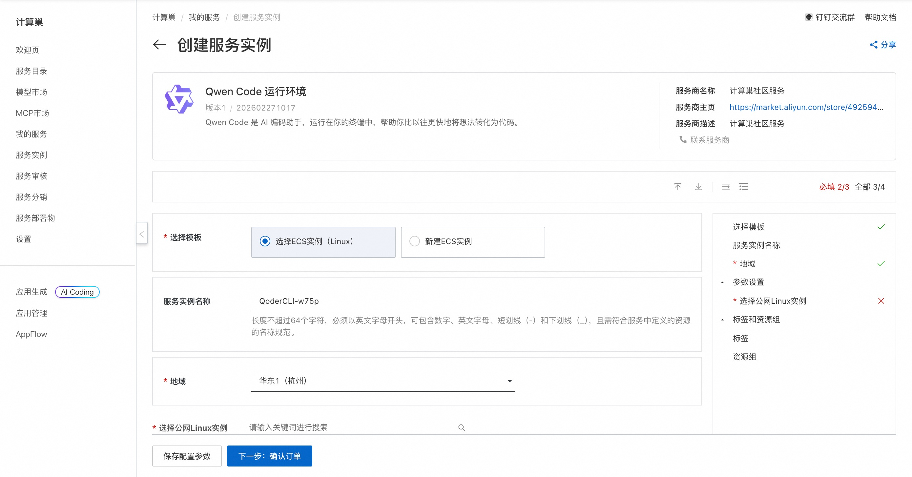
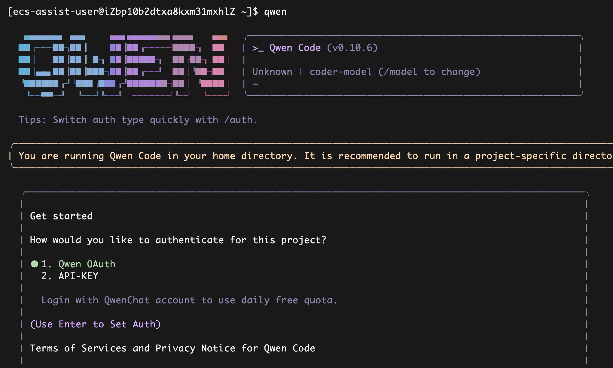

## 🌟 服务简介

> 💥 **告别重复编码，让 AI 成为你的超级副驾！**  
> **Qwen Code** 不只是工具——它是通义千问家族专为开发者打造的智能编程引擎，深度理解项目上下文，一行指令即可生成高质量代码、单元测试、文档注释与逻辑解释。开发效率飙升 300%，代码质量肉眼可见提升！

Qwen Code 是基于通义千问大模型的开源代码智能助手，支持 Python、Java、JavaScript、Go、TypeScript 等主流语言。它能自动补全函数、修复 Bug、生成测试用例、解释复杂算法，并通过 CLI 或 IDE 插件无缝融入你的开发流程，真正实现“所想即所得”的智能编程体验。

## 🚀 部署流程

> ⚡ **5 分钟极速上线，无需配置，开箱即用！**  
> 借助阿里云计算巢，一键部署 Qwen Code 社区版，省去 Python 环境、依赖库、模型下载等繁琐步骤，立即获得本地化智能编程能力！

1. 访问计算巢 Qwen Code 社区版 [部署链接](https://computenest.console.aliyun.com/service/instance/create/cn-hangzhou?type=user&ServiceId=service-b10df9636a9e4816bfaf)，按页面提示填写部署参数（如实例名称、地域）：  
   

2. 参数配置完成后，系统将自动生成**费用预估明细**。建议选择 ≥2核4GB 配置以保障推理流畅性，确认无误后点击 **下一步：确认订单**。

3. 在订单确认页，核对实例信息与费用，点击 **立即创建** 开始自动部署。

4. 部署完成后，远程连接ECS，执行 qwen 开始使用：  
   

## 📚 使用指南

使用请参考 Qwen Code [官方文档](https://qwenlm.github.io/qwen-code-docs/zh/) 了解完整命令列表、示例及最佳实践。